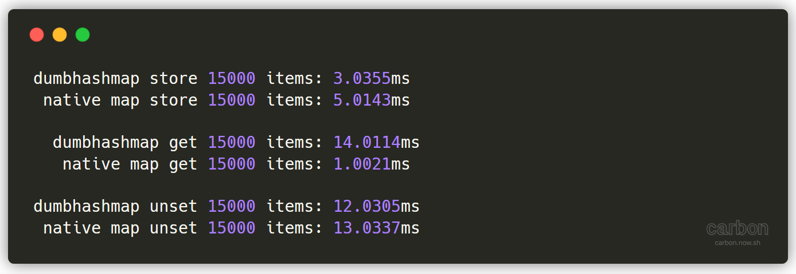
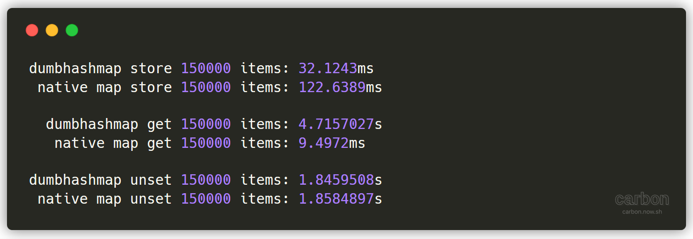

## dumbhashmap

This is a very barebones implementation of a hashmap in Go.

The main package runs a basic benchmark of dumbhashmap vs. Go's native hashmap (map) using the provided load constant.

dumbhashmap uses a fixed set of 256 buckets for object storage, and falls back to linear list iteration for hash collisions. It uses the hashing algorithm from [string-hash](https://www.npmjs.com/package/string-hash), which is a slightly modified version of `dbj2` by Dan Bernstein ([link](http://www.cse.yorku.ca/%7Eoz/hash.html)). It does not support any form of resizing, and currently only implements `Get` and `Set`, with no ability to delete items. Overwritten key-value pairs remain in their original buckets.

Preliminary testing has led to some... interesting results.

